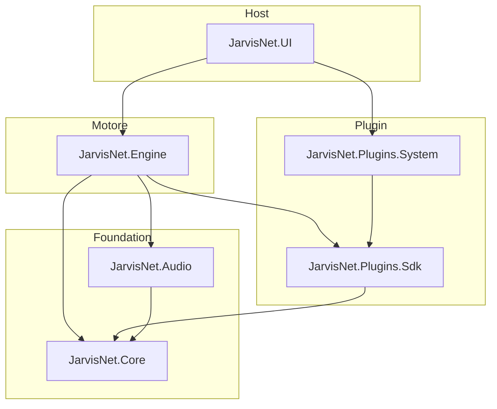

# JarvisNet

Assistente personale in stile «Jarvis», sviluppato in **.NET 10**. L’obiettivo è combinare un motore conversazionale basato su **Semantic Kernel** e modelli locali (**Ollama**), input/output **audio** (cattura e sintesi vocale) e un sistema di **plugin** estendibile, esposto tramite un host web ASP.NET Core.

> **Stato attuale:** la solution definisce i moduli e le dipendenze principali; gran parte della logica di dominio è ancora da implementare. L’host principale è `JarvisNet.UI`.

## Architettura



| Progetto | Ruolo |
|----------|--------|
| **JarvisNet.Core** | Tipi condivisi, contratti e logica di base. |
| **JarvisNet.Engine** | Orchestrazione dell’assistente (Semantic Kernel, connettore Ollama). |
| **JarvisNet.Audio** | Audio in/out (NAudio WASAPI/ALSA, STT Sherpa-ONNX, TTS PiperSharp). |
| **JarvisNet.Plugins.Sdk** | API per scrivere plugin compatibili con il motore. |
| **JarvisNet.Plugins.System** | Plugin di sistema forniti out-of-the-box. |
| **JarvisNet.UI** | API web (Minimal API) — punto di ingresso consigliato per eseguire l’applicazione. |
| **JarvisNet.UI.Server** | Progetto web aggiuntivo in solution (scaffold separato). |

### Test

| Progetto | Framework | Riferimento |
|----------|-----------|-------------|
| **JarvisNet.UnitTests** | NUnit | `JarvisNet.Engine` |
| **JarvisNet.IntegrationTests** | NUnit | `JarvisNet.UI` |
| **JarvisNet.Audio.UnitTests** | NUnit | `JarvisNet.Audio` |
| **JarvisNet.Audio.IntegrationTests** | NUnit | `JarvisNet.Audio` |
| **JarvisNet.Audio.TestApp** | Console | test interattivo microfono/STT/TTS |
| **JarvisNet.Engine.UnitTests** | NUnit | `JarvisNet.Engine` |
| **JarvisNet.Engine.IntegrationTests** | NUnit | `JarvisNet.Engine` (Ollama locale) |
| **JarvisNet.Engine.TestApp** | Console | conversazione vocale STT → Ollama → TTS |

## Prerequisiti

- [.NET 10 SDK](https://dotnet.microsoft.com/download)
- Per il motore LLM locale: [Ollama](https://ollama.com/) con modello **`jarvis:1b-new`** (tag in `/api/tags`; es. `ollama pull jarvis:1b-new`)
- Stack audio: **Windows** (WASAPI) e **Linux** (`libasound2`); modelli in `models/` e Piper in `piper/` alla root del repo

## Quick start

Dalla root del repository:

```powershell
dotnet restore JarvisNet.slnx
dotnet build JarvisNet.slnx
dotnet run --project src/JarvisNet.UI/JarvisNet.UI.csproj
```

In sviluppo, l’API espone OpenAPI su `/openapi/v1.json` (profilo predefinito in `launchSettings.json`: HTTP `5194`, HTTPS `7077`).

Eseguire i test:

```powershell
dotnet test JarvisNet.slnx
```

Modelli ONNX e Piper condivisi (root repo, usati da TestApp e host reali):

```powershell
powershell -ExecutionPolicy Bypass -File scripts/Download-Models.ps1
powershell -ExecutionPolicy Bypass -File scripts/Download-Models.ps1 -Locale es
powershell -ExecutionPolicy Bypass -File scripts/Download-Piper.ps1
```

Config condivise (caricate con `AddJarvisNetSharedAudioConfiguration` / `AddJarvisNetSharedEngineConfiguration`):

| Area | File |
|------|------|
| Engine (Ollama) | [`config/jarvisnet.engine.json`](config/jarvisnet.engine.json) |

Config audio condivisa:

| Profilo | File |
|---------|------|
| Italiano (default) | [`config/jarvisnet.audio.json`](config/jarvisnet.audio.json) |
| Spagnolo (Spagna) | [`config/jarvisnet.audio.es.json`](config/jarvisnet.audio.es.json) |

Per il TestApp in spagnolo: `$env:JARVISNET_AUDIO_PROFILE="es"` prima di `dotnet run`, oppure passa il profilo a `AddJarvisNetSharedAudioConfiguration(..., profile: "es")`.

Voce TTS (`JarvisNet:Audio:PiperVoiceKey`):

| Chiave | Lingua | Voce |
|--------|--------|------|
| `it_IT-paola-medium` | IT | donna (default) |
| `it_IT-riccardo-x_low` | IT | uomo |
| `es_ES-sharvard-medium` | ES (Spagna) | donna (speaker 1, consigliata) |
| `es_ES-mls_10246-low` | ES | donna (bassa qualità) |
| `es_AR-daniela-high` | ES (Argentina) | donna, alta qualità |
| `es_ES-carlfm-x_low` | ES | uomo |

Test vocale interattivo (solo audio):

```powershell
dotnet run --project tests/JarvisNet.Audio.TestApp/JarvisNet.Audio.TestApp.csproj
$env:JARVISNET_AUDIO_PROFILE="es"; dotnet run --project tests/JarvisNet.Audio.TestApp/JarvisNet.Audio.TestApp.csproj
```

Conversazione vocale end-to-end (STT → Ollama → TTS):

```powershell
dotnet run --project tests/JarvisNet.Engine.TestApp/JarvisNet.Engine.TestApp.csproj
```

Il motore usa **Microsoft Semantic Kernel** con connettore **Ollama** (pacchetto alpha, warning sperimentale `SKEXP0070` soppresso nel codice di registrazione).

## Struttura repository

```
JarvisNet/
├── JarvisNet.slnx
├── config/                    ← jarvisnet.audio.json, jarvisnet.engine.json
├── scripts/                   ← Download-Models.ps1, Download-Piper.ps1
├── models/                    ← stt/, tts/ (gitignored, download script)
├── piper/                     ← runtime Piper (gitignored)
├── src/
│   ├── JarvisNet.Core/
│   ├── JarvisNet.Engine/
│   ├── JarvisNet.Audio/
│   ├── JarvisNet.Plugins.Sdk/
│   ├── JarvisNet.Plugins.System/
│   ├── JarvisNet.UI/          ← host principale
│   └── JarvisNet.UI.Server/
└── tests/
    ├── JarvisNet.UnitTests/
    ├── JarvisNet.Audio.UnitTests/
    ├── JarvisNet.Audio.IntegrationTests/
    ├── JarvisNet.Audio.TestApp/
    ├── JarvisNet.Engine.UnitTests/
    ├── JarvisNet.Engine.IntegrationTests/
    ├── JarvisNet.Engine.TestApp/
    └── JarvisNet.IntegrationTests/
```

## Stack tecnologico

- **ASP.NET Core** — host HTTP e OpenAPI
- **Microsoft Semantic Kernel** + **Ollama** — ragionamento e chat con modelli locali
- **NAudio** / **PiperSharp** — pipeline audio
- **NUnit** — test unitari e di integrazione

## Configurazione

Impostazioni di base in `src/JarvisNet.UI/appsettings.json` e `appsettings.Development.json`. Ollama è configurabile in [`config/jarvisnet.engine.json`](config/jarvisnet.engine.json) (`JarvisNet:Ollama`: `Endpoint`, `ModelName`, `SystemPrompt`, `Temperature`). Evitare di committare segreti (vedi `.gitignore`).

## Licenza

Da definire.
