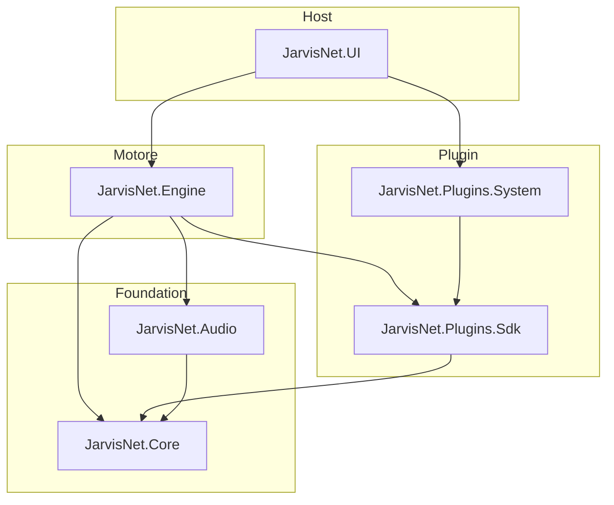

# JarvisNet

Assistente personale in stile «Jarvis», sviluppato in **.NET 10**. L’obiettivo è combinare un motore conversazionale basato su **Semantic Kernel** e modelli locali (**Ollama**), input/output **audio** (cattura e sintesi vocale) e un sistema di **plugin** estendibile, esposto tramite un host web ASP.NET Core.

> **Stato attuale:** la solution definisce i moduli e le dipendenze principali; gran parte della logica di dominio è ancora da implementare. L’host principale è `JarvisNet.UI`.

## Architettura



| Progetto | Ruolo |
|----------|--------|
| **JarvisNet.Core** | Tipi condivisi, contratti e logica di base. |
| **JarvisNet.Engine** | Orchestrazione dell’assistente (Semantic Kernel, connettore Ollama). |
| **JarvisNet.Audio** | Audio in/out (NAudio, sintesi con PiperSharp). |
| **JarvisNet.Plugins.Sdk** | API per scrivere plugin compatibili con il motore. |
| **JarvisNet.Plugins.System** | Plugin di sistema forniti out-of-the-box. |
| **JarvisNet.UI** | API web (Minimal API) — punto di ingresso consigliato per eseguire l’applicazione. |
| **JarvisNet.UI.Server** | Progetto web aggiuntivo in solution (scaffold separato). |

### Test

| Progetto | Framework | Riferimento |
|----------|-----------|-------------|
| **JarvisNet.UnitTests** | NUnit | `JarvisNet.Engine` |
| **JarvisNet.IntegrationTests** | NUnit | `JarvisNet.UI` |

## Prerequisiti

- [.NET 10 SDK](https://dotnet.microsoft.com/download)
- Per il motore LLM locale: [Ollama](https://ollama.com/) (e un modello installato), quando l’integrazione sarà attiva nel codice
- Windows consigliato per lo stack audio (NAudio / Piper); verificare compatibilità su altri OS

## Quick start

Dalla root del repository:

```powershell
dotnet restore JarvisNet.slnx
dotnet build JarvisNet.slnx
dotnet run --project src/JarvisNet.UI/JarvisNet.UI.csproj
```

In sviluppo, l’API espone OpenAPI su `/openapi/v1.json` (profilo predefinito in `launchSettings.json`: HTTP `5194`, HTTPS `7077`).

Eseguire i test:

```powershell
dotnet test JarvisNet.slnx
```

## Struttura repository

```
JarvisNet/
├── JarvisNet.slnx
├── src/
│   ├── JarvisNet.Core/
│   ├── JarvisNet.Engine/
│   ├── JarvisNet.Audio/
│   ├── JarvisNet.Plugins.Sdk/
│   ├── JarvisNet.Plugins.System/
│   ├── JarvisNet.UI/          ← host principale
│   └── JarvisNet.UI.Server/
└── tests/
    ├── JarvisNet.UnitTests/
    └── JarvisNet.IntegrationTests/
```

## Stack tecnologico

- **ASP.NET Core** — host HTTP e OpenAPI
- **Microsoft Semantic Kernel** + **Ollama** — ragionamento e chat con modelli locali
- **NAudio** / **PiperSharp** — pipeline audio
- **NUnit** — test unitari e di integrazione

## Configurazione

Impostazioni di base in `src/JarvisNet.UI/appsettings.json` e `appsettings.Development.json`. Chiavi per Ollama, modelli Piper e segreti andranno aggiunte man mano che il motore e l’audio saranno collegati all’host; evitare di committare segreti (vedi `.gitignore`).

## Licenza

Da definire.
